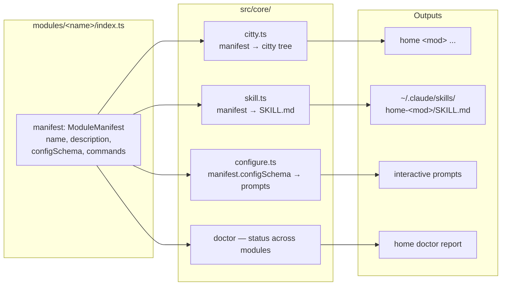

# `home` — Monolith CLI for Homelab Services

## Context

You want a single CLI (`home`) that gives both you and local LLMs uniform access to your homelab services — starting with **Unifi Network**, **Unifi Protect**, and **Home Assistant**. The CLI is a monolith with a module-per-service layout. Each module owns its own configure step and persists config/secrets so tokens don't need to be re-entered each session. Every module auto-generates a Claude skill so an LLM can pick up a module and use it immediately.

The repo will live at `~/Projects/home`, ship from GitHub with CI/CD, and your Proxmox compute nodes (no-AVX Linux x86_64) and your Mac will install pre-built versioned binaries.

## Architectural decisions (locked)

| Area          | Decision                                                                                                                 |
| ------------- | ------------------------------------------------------------------------------------------------------------------------ |
| Runtime       | Bun + TypeScript                                                                                                         |
| CLI framework | `citty` (UnJS), static `subCommands` map                                                                                 |
| Module layout | Static folder-per-module under `src/modules/`, registered in `src/index.ts`                                              |
| Config root   | `~/.config/home/` (XDG-style; matches your existing chezmoi/gh/git pattern)                                              |
| Secrets       | OS keyring (macOS Keychain / libsecret) via `@napi-rs/keyring`, file fallback at `~/.config/home/secrets.json` mode 0600 |
| Skills        | One skill per module, auto-generated to `~/.claude/skills/home-<module>/SKILL.md`                                        |
| Build targets | `bun-linux-x64-baseline` (no-AVX safe for your PVE host) + `bun-darwin-arm64`                                            |
| API approach  | Mixed — `unifi-protect` SDK for Protect, thin `fetch` clients for Unifi Network and Home Assistant REST                  |
| Prompt UX     | `consola.prompt` (citty's default — no new dependency)                                                                   |

## Repository layout

```
~/Projects/home/
  .github/workflows/
    ci.yml                  # typecheck + test on push/PR
    release.yml             # build + publish binaries on tag v*
  src/
    index.ts                # citty root, registers modules
    core/
      types.ts              # ModuleManifest, CommandSpec, RunContext, RunResult
      paths.ts              # XDG path resolution
      config.ts             # load/save ~/.config/home/* JSON + $schemaVersion migrations
      secrets.ts            # keyring abstraction + mode-0600 file fallback
      output.ts             # --json / table / log formatters
      errors.ts             # UserError / SystemError / NotConfiguredError
      http.ts               # ~30-line fetch wrapper: timeout, retries, AbortController
      citty.ts              # buildCommandTree(manifest) → citty defineCommand tree
      configure.ts          # generic configure driver — reads manifest.configSchema
      skill.ts              # SKILL.md generator from manifests
    modules/
      unifi/
        index.ts            # manifest (default export); no top-level side effects
        configure.ts        # one-liner: delegates to core/configure.ts
        client.ts           # thin fetch-based UniFi Network client (via core/http)
        commands/
          devices.ts
          clients.ts
          site.ts
      protect/
        index.ts
        configure.ts        # delegates to core/configure.ts
        client.ts           # wraps unifi-protect SDK
        commands/
          cameras.ts
          events.ts
          snapshot.ts
      assistant/
        index.ts
        configure.ts        # delegates to core/configure.ts
        client.ts           # thin Home Assistant REST client (via core/http)
        commands/
          states.ts
          service.ts
          automation.ts
          history.ts
          logbook.ts
  scripts/
    install.sh              # curl | sh installer (detects OS/arch)
  package.json              # pinned bun engine
  tsconfig.json             # strict, moduleResolution: bundler, target: esnext, types: [bun-types]
  bun.lockb
  README.md
```

`src/index.ts` imports each module statically and registers it on the citty root, so `bun build --compile` can fully bundle. Adding a new module = create the folder + add one line to the registry.

**Module rule:** `modules/*/index.ts` has no top-level side effects — no config loads, no network calls, no `console.log`. Anything observable happens inside a command's `run(ctx)`. This keeps `home --help` instant in the compiled binary.

## Shape of the module contract

One manifest per module, two derivations: the citty CLI tree and the SKILL.md.



## Module contract

Each `modules/<name>/index.ts` exports a single `ModuleManifest` (also its
default export). `src/core/citty.ts` builds the citty subcommand tree from it;
`src/core/skill.ts` builds the SKILL.md from it. Single source of truth.

```ts
// src/core/types.ts

export type ArgKind = "positional" | "string" | "boolean" | "number";

export interface ArgSpec {
  name: string;
  kind: ArgKind;
  description: string;
  required?: boolean;
  default?: string | number | boolean;
  enum?: readonly string[];
}

export interface RunContext {
  args: Record<string, string | number | boolean | undefined>;
  json: boolean;
  quiet: boolean;
  verbose: boolean;
  log: ConsolaInstance; // from consola
  config: ModuleConfig; // resolved + secrets decrypted
}

export type RunResult =
  | { ok: true; data?: unknown } // exit 0
  | {
      ok: false;
      kind: "user" | "system" | "config";
      message: string;
      code?: string;
    }; // exit 1/2/3

export interface CommandSpec {
  path: string[]; // ['devices', 'list'] or ['snapshot']
  description: string;
  args: ArgSpec[];
  examples: string[]; // shell strings; reused in --help and SKILL.md
  run: (ctx: RunContext) => Promise<RunResult>;
}

export type ConfigFieldKind = "url" | "string" | "secret" | "enum" | "boolean";

export interface ConfigField {
  key: string; // secrets live in keyring, not in the JSON file
  label: string;
  kind: ConfigFieldKind;
  required?: boolean;
  default?: string | boolean;
  enum?: readonly string[];
  help?: string;
  validate?: (v: string) => string | null; // sync; error msg or null
  probe?: (cfg: ModuleConfig) => Promise<string | null>; // async; end-of-flow check
}

export interface ModuleManifest {
  name: string; // 'unifi' | 'protect' | 'assistant'
  description: string; // one line — citty help + SKILL frontmatter
  whenToUse: string; // 2-3 sentences for SKILL.md "when to use" section
  configSchema: ConfigField[];
  commands: CommandSpec[];
  status: (cfg: ModuleConfig) => Promise<RunResult>; // backs `home <mod> status`
}
```

```ts
// src/modules/unifi/index.ts
import type { ModuleManifest } from "../../core/types";
export const manifest: ModuleManifest = {
  /* … */
};
export default manifest;
```

```ts
// src/index.ts
import unifiManifest from "./modules/unifi";
import protectManifest from "./modules/protect";
import assistantManifest from "./modules/assistant";
import { buildCommandTree } from "./core/citty";

const root = defineCommand({
  meta: { name: "home", version: __HOME_VERSION },
  subCommands: {
    unifi: buildCommandTree(unifiManifest),
    protect: buildCommandTree(protectManifest),
    assistant: buildCommandTree(assistantManifest),
    init: initCmd,
    configure: configureAllCmd,
    skill: skillCmd,
    doctor: doctorCmd,
    secrets: secretsCmd, // export / import
  },
});
```

`buildCommandTree(manifest)` returns a citty `defineCommand` tree with `meta`,
nested `subCommands` indexed by `path[0]`, and an auto-wired handler that
loads/validates module config (returns exit 3 if missing), assembles
`RunContext`, invokes `command.run(ctx)`, and routes the `RunResult` to the
global formatter + exit code.

**Why static imports:** `bun build --compile` snapshots the dependency graph at
build time. Static imports keep every manifest reachable from the entry, so
nothing gets tree-shaken; citty's `--help` for the root only reads `meta` from
each subcommand (no command bodies run), so startup stays fast. Module index
files are just a manifest object plus a few `run` closures — bundling them
eagerly is free.

## Baked-in subcommands every module gets

All three are auto-generated by `buildCommandTree` from the manifest:

- `home <mod> configure` — interactive prompts derived from `configSchema`; writes non-secret values to `~/.config/home/modules/<mod>.json`, stores secrets via keyring
- `home <mod> status` — invokes `manifest.status(cfg)`; connectivity/auth health check
- `home <mod> skill` — regenerates that module's `SKILL.md`

Plus module-specific commands (see below).

## Top-level subcommands

- `home init` — creates `~/.config/home/` skeleton; probes the keyring backend once and persists the choice in `config.json`
- `home configure` — runs every registered module's configure flow
- `home skill install` — writes/refreshes all `~/.claude/skills/home-<mod>/` skills
- `home doctor` — runs `status` across all configured modules; also prints update check + telemetry status
- `home secrets export --out <path>` / `home secrets import --in <path>` — see "Config and secrets"
- `home --version` (commit SHA on `--verbose`)

## Config and secrets

- `~/.config/home/config.json` — global: log level, default output format, `secretsBackend: 'keyring' | 'file'`, `$schemaVersion: 1`
- `~/.config/home/modules/<name>.json` — non-secret per-module config (URLs, site IDs, `insecureTLS`); each carries `$schemaVersion: 1`
- Secrets via `@napi-rs/keyring`:
  - service: `home-cli`
  - account: `<module>:<key>` (e.g. `unifi:apiKey`, `assistant:token`)
- `core/secrets.ts` exposes `getSecret(module, key)` / `setSecret(module, key, value)` / `deleteSecret(module, key)` / `listSecretKeys(module)` — modules never touch storage directly.

**Backend selection.** Happens once during `home init` (or first `home <mod> configure`). The probe runs `getSecret('__probe__', '__probe__')`; if it throws `org.freedesktop.DBus.Error.ServiceUnknown` or libsecret is missing, the user is prompted: "No keyring available on this host. Use ~/.config/home/secrets.json mode 0600 instead? [y/N]". Yes records `secretsBackend: 'file'` in `config.json`; no aborts so the user can install libsecret. macOS Keychain prompts to unlock once per process; configure warns before the first `setSecret`.

**Migration.** `home secrets export --out <path>` writes a JSON blob of `{module, key, value}` rows from the active backend (warn: "this file is plaintext — encrypt before transport"). `home secrets import --in <path>` reads it and writes via the active backend. JSON blob carries `$schemaVersion: 1`.

**Rotation.** `home <mod> configure --rotate` re-prompts secrets only; `--force` re-prompts everything.

> The mode-0600 plaintext fallback is what's locked. If LXC hosts are multi-tenant and root-equivalent users on the host can read the file, a passphrase-encrypted fallback is an easy follow-up — out of scope here.

### Configure flow

- **Prompt library:** `consola.prompt` (transitive via citty/unjs — zero new dep). Covers `text`, `confirm`, `select`, `multiselect` — sufficient for every `ConfigFieldKind`.
- **Validation:** `ConfigField.validate(v)` runs synchronously after the prompt; non-null returns are shown and the field is re-prompted. URL fields get a default validator that calls `new URL()`.
- **Probe (live check):** at end of flow, every field with `probe` runs against the assembled config. On failure, the user is asked "Save anyway and run `home <mod> status` later? [y/N]" — yes saves degraded, no re-enters the failing field.
- **Atomic writes:** write to `~/.config/home/modules/<name>.json.partial`, then `fs.renameSync` to `<name>.json` only after all probes pass or the user accepts degraded mode. Ctrl-C deletes the partial.
- **Cancellation:** consola's `cancel` symbol propagates as `UserError('cancelled')`; the top-level handler exits 1 silently.

## LLM-friendly output

- Every command accepts `--json` for structured output (silent otherwise)
- Default human output: short tables / single-line summaries
- Exit codes: `0` ok, `1` user error, `2` system error, `3` not configured
- Global `--quiet` and `--verbose`
- Errors emitted to stderr; JSON output goes to stdout cleanly so LLMs can pipe-parse

## Cross-cutting

- **Logging.** `consola` (citty's default). `--quiet` → `error`, `--verbose` → `debug`; env `HOME_LOG=debug|info|warn|error` overrides. All logs to stderr. `--json` forces level `error` so stdout stays parseable.
- **Error taxonomy.** `src/core/errors.ts` exports `UserError` (exit 1), `SystemError` (exit 2), `NotConfiguredError` (exit 3). Each carries `code: string` and `message: string`. Top-level handler in `src/index.ts` catches, formats (`{ ok: false, code, message }` if `--json`, red text otherwise), exits.
- **HTTP defaults.** Each module's `client.ts` calls `fetch` directly. Shared behavior lives in `core/http.ts` (~30 lines): `request(url, init, { timeout = 10_000, retries = 3, retryOn = ['5xx', 'network'], retryDelayMs = exp(250) })`. No new runtime dep — just `fetch` + `AbortController`. Helper signature mirrors `ofetch` so it can be swapped later.
- **TLS / self-signed.** UniFi controllers ship self-signed certs. `configure` prompts "Allow self-signed certificate? [y/N]" for `unifi` and `protect`; yes stores `insecureTLS: true` in module config. Client uses an `undici` dispatcher with `connect: { rejectUnauthorized: false }` for those requests only. HA's prompt defaults to no.
- **Telemetry.** Explicitly none. Stated in README and as a `home doctor` line ("Telemetry: off (no-op).").
- **Update check.** `home doctor` fetches the latest tag from `api.github.com/repos/<owner>/home/releases/latest`, prints `current vs latest`, suggests `install.sh`. No automatic upgrade. 10s timeout, soft-fail offline.
- **Schema versioning.** Every JSON config file carries `"$schemaVersion": 1`. `core/config.ts` runs migrations N→N+1 on load. No migrations exist at launch; the field is present so adding one in v0.2 is non-breaking.

## Auto-generated skills

`core/skill.ts` reads each module's `manifest` and writes:

```
~/.claude/skills/home-<module>/SKILL.md
```

The template uses `manifest.name`, `manifest.description`, `manifest.whenToUse`, `manifest.configSchema`, and `manifest.commands` — nothing else. Re-running `home skill install` is idempotent.

### Template

````markdown
---
name: home-<module>
description: <manifest.description>
---

# home-<module>

<manifest.description>

The `home` CLI persists credentials locally, so you can call commands directly
without asking the user for tokens.

## Setup check

```bash
home <module> status
```

Exit 0 = ready. Exit 3 = not configured — tell the user to run
`home <module> configure` (interactive, you cannot drive it).

## Commands

| Command                                                                 | Purpose           |
| ----------------------------------------------------------------------- | ----------------- |
| <for each c in manifest.commands>`home <module> <c.path joined> [args]` | `<c.description>` |

All commands accept `--json` for structured output (stdout-only, errors on
stderr). Default human output is short tables — use `--json` when reading
programmatically.

## Examples

<each c.examples string rendered in a fenced bash block>

## Exit codes

- 0 ok
- 1 user error (bad arg, unknown flag)
- 2 system error (network, controller unreachable)
- 3 not configured — run `home <module> configure`

## When to use this skill

<manifest.whenToUse>
````

### Worked example: `home-unifi`

````markdown
---
name: home-unifi
description: Query the UniFi Network controller (devices, clients, sites, health) via the local `home unifi` CLI.
---

# home-unifi

Query the UniFi Network controller (devices, clients, sites, health) via the
local `home unifi` CLI.

The `home` CLI persists credentials locally, so you can call commands directly
without asking the user for tokens.

## Setup check

```bash
home unifi status
```

Exit 0 = ready. Exit 3 = not configured — tell the user to run
`home unifi configure` (interactive, you cannot drive it).

## Commands

| Command                               | Purpose                                      |
| ------------------------------------- | -------------------------------------------- |
| `home unifi devices list --json`      | All adopted devices (APs, switches, gateway) |
| `home unifi devices get <mac> --json` | One device with full detail                  |
| `home unifi clients list --json`      | Currently-connected clients                  |
| `home unifi site info --json`         | Site identity and raw stats                  |
| `home unifi site health --json`       | Per-subsystem health (WAN, LAN, WLAN, WWW)   |

## Examples

```bash
home unifi devices list --json | jq '.[] | select(.type=="uap")'
home unifi clients list --json | jq '.[] | select(.hostname | test("phone";"i"))'
home unifi site health --json | jq '.[] | select(.status!="ok")'
```

## Exit codes

- 0 ok, 1 user error, 2 system error, 3 not configured

## When to use this skill

Use when the user asks about their home network, wifi, APs, switches, the
gateway, or wired/wireless clients. Don't use for cameras (that's
`home-protect`) or sensors/automations (that's `home-assistant`).
````

## Build and distribution

- Dev: `bun run dev -- <args>` runs `src/index.ts` directly
- Release builds (in CI):
  - `bun build --compile --target=bun-linux-x64-baseline src/index.ts --outfile dist/home-linux-x64 --define '__HOME_VERSION=JSON.stringify(pkg.version)' --define '__HOME_COMMIT=JSON.stringify(commit)'`
  - `bun build --compile --target=bun-darwin-arm64 src/index.ts --outfile dist/home-darwin-arm64 --define '__HOME_VERSION=JSON.stringify(pkg.version)' --define '__HOME_COMMIT=JSON.stringify(commit)'`
- The `-baseline` Linux target compiles without AVX, which matches your PVE host's CPU
- `scripts/install.sh` detects OS+arch, fetches the matching asset from the latest GitHub release, drops it in `~/.local/bin/home` (default — no sudo). Falls back to `/usr/local/bin/home` with sudo only if `~/.local/bin` is not on `PATH` and the user opts in.

## CI/CD

- `.github/workflows/ci.yml` — on push/PR: `bun install`, `bun run typecheck`, `bun test`. Bun version pinned to match `package.json` `engines.bun`.
- `.github/workflows/release.yml` — on tag `v*`: build both binaries on the matching runners (`ubuntu-latest`, `macos-14`), create a GitHub Release, attach binaries + `install.sh`. Bun version pinned.
- Semantic version tags drive releases; `home --version` is baked in at build time via `--define`.

## Versioning

- Pre-1.0 (`0.x.y`): minor bumps may break CLI args or output shape. Release notes call out "Breaking" / "New" / "Fixed".
- Post-1.0 semver:
  - Breaking CLI args, output shape, config schema, or `ModuleManifest` shape → **major**
  - New commands or new args (backwards-compat), additive config fields with defaults → **minor**
  - Fixes → **patch**
- **Independent file schemas.** `config.json` and each `modules/<name>.json` carry `$schemaVersion`. A bump in either is a breaking change for `home` (major). `core/config.ts` runs forward migrations on load.
- **`home --version`** — compiled binary prints constants injected at build time via `--define '__HOME_VERSION=...' --define '__HOME_COMMIT=...'`. In `bun run dev`, reads `package.json` and `git rev-parse --short HEAD` once at startup. Format: `home 0.1.0`; `--verbose` appends commit SHA: `home 0.1.0 (a1b2c3d)`.

## Per-module first-pass commands

**`unifi`** (UniFi Network, thin HTTP client)

- Configure prompts: controller URL, API key (UniFi OS 9.x official API), site name, allow self-signed cert
- `devices list`, `devices get <mac>`, `clients list`, `site info`, `site health` (per-subsystem health array — the LLM-friendly view of "is the network ok?")

**`protect`** (Unifi Protect, via `unifi-protect` npm package)

- Configure prompts: controller URL, local Protect username, password, allow self-signed cert
- `cameras list`, `cameras get <id>`, `events list [--since] [--limit]`, `events recent --type motion|smart [--camera <id>] [--limit 10]` (pre-filtered, newest-first), `snapshot <camera> [--out path]`

**`assistant`** (Home Assistant, thin REST client)

- Configure prompts: HA base URL, long-lived access token
- `states list [--domain]`, `state get <entity_id>`, `service call <domain>.<service> [--data json]`, `automation trigger <entity_id>`
- `history get <entity_id> [--since 1h|24h|ISO]` — answers "was the door open this morning?"
- `logbook list [--since 1h|24h|ISO] [--entity <id>]` — recent human-readable events; high LLM utility

## Spike (day 1)

Before writing real modules, validate the manifest → citty → compiled-binary
loop end-to-end. If this pattern doesn't survive `bun build --compile`, the
contract changes and module code has to be rewritten — better to find out on
day 1.

1. `src/core/types.ts` — `ModuleManifest`, `CommandSpec`, `RunContext`.
2. `src/core/citty.ts` — `buildCommandTree(manifest)` (~50 lines).
3. `src/modules/hello/index.ts` — manifest with one command: `hello say <name> --shout` echoes input (`shout` uppercases).
4. `src/index.ts` — static import + register `hello`.
5. `bun run src/index.ts hello say world` — prints `world`.
6. `bun build --compile --target=bun-darwin-arm64 src/index.ts --outfile /tmp/home-spike`.
7. `/tmp/home-spike hello say world --shout` — prints `WORLD`.
8. `/tmp/home-spike --help` — lists `hello` under subcommands.

If 5–8 all pass: lock the contract, delete the spike branch, start
implementation. If any fail: rework the contract before writing module code.

## Critical files to create (in order)

1. **Spike** — `src/core/types.ts`, `src/core/citty.ts`, `src/modules/hello/index.ts`, `src/index.ts`. Validate per the eight steps above.
2. `package.json` (pin `engines.bun`), `tsconfig.json` (strict, `moduleResolution: 'bundler'`, `target: 'esnext'`, `types: ['bun-types']`), `.gitignore`.
3. Core primitives: `src/core/{paths, config, secrets, output, errors, http}.ts`.
4. `src/core/skill.ts` — SKILL.md template + writer.
5. `src/core/configure.ts` — generic configure driver.
6. `src/index.ts` — citty root + `init` / `configure` / `skill install` / `doctor` / `secrets export|import`.
7. **`unifi` module end-to-end** to validate the contract on a real service before duplicating.
8. `protect` module.
9. `assistant` module.
10. `.github/workflows/ci.yml`, `release.yml`.
11. `scripts/install.sh`.
12. `README.md` with install + quick-start (and explicit "no telemetry").

> Suggestion (not a change): HA has no self-signed-cert detour, so if you want to surface module-contract issues sooner, swap `assistant` to step 7. Order above matches the original plan.

## Verification

After build:

- `bun install && bun run typecheck` — clean
- `bun test` — passes (uses `bun:test`; tests live next to source as `*.test.ts`; covers core helpers, manifest→citty derivation, manifest→SKILL.md generation, and mocked HTTP clients)
- **Spike acceptance:** all eight steps in "Spike (day 1)" pass
- `bun run dev -- --help` — citty shows all three modules
- `bun run dev -- init` — creates `~/.config/home/` structure; probes keyring; records `secretsBackend`
- `bun run dev -- unifi configure` — interactive flow, secret lands in macOS Keychain (`security find-generic-password -s home-cli -a 'unifi:apiKey'` confirms)
- `bun run dev -- unifi status` — exits 0 against the live controller
- `bun run dev -- unifi devices list --json | jq .` — well-formed JSON
- `bun run dev -- unifi site health --json | jq '.[] | select(.status!="ok")'` — surfaces non-OK subsystems
- `bun run dev -- skill install` — writes `~/.claude/skills/home-unifi/SKILL.md` etc.; opening a fresh Claude Code session lists them under available skills
- **Headless-Linux fallback:** on a Proxmox LXC without libsecret/dbus, `bun run dev -- init` prompts and records `secretsBackend: 'file'`; subsequent `unifi configure` writes to `~/.config/home/secrets.json` mode 0600
- `bun build --compile --target=bun-darwin-arm64 src/index.ts --outfile /tmp/home` then `/tmp/home --help` — single binary works; `/tmp/home --version --verbose` shows version + commit SHA
- Tag `v0.0.1`, push, watch CI produce both binaries, attach to release; install on a Proxmox LXC via `install.sh`, run `home assistant states list`

## Changes from the original

- **Module contract collapsed to a single source of truth.** Modules now export only a `ModuleManifest`; `src/core/citty.ts#buildCommandTree` derives the citty subcommand tree, and `src/core/skill.ts` derives the SKILL.md, both from `manifest.commands`. Removes the parallel `defineCommand` + `manifest` duplication.
- **Static imports pinned.** `src/index.ts` imports each module statically; no lazy `() => import(...)`. Safer with `bun build --compile`, and citty doesn't need command bodies to render root help. Module rule added: no top-level side effects in `modules/*/index.ts`.
- **SKILL.md template made concrete.** Replaced the prose description with a literal template plus a worked `home-unifi` example.
- **Secrets layer hardened (within locked backends).** Headless-Linux auto-detection at `home init`, persisted backend choice in `config.json`, `home secrets export/import` over plaintext blob (with transport warning), `configure --rotate` / `--force`. Locked storage (keyring + mode-0600 plaintext file) unchanged.
- **Configure flow specified.** `consola.prompt` chosen, sync `validate` per field, async `probe` at end, atomic write via `.partial` rename, Ctrl-C discards.
- **Cross-cutting concerns added.** Logging (consola levels), error taxonomy (`UserError`/`SystemError`/`NotConfiguredError`), HTTP defaults via a tiny `core/http.ts` over plain `fetch` (10s timeout, 3 retries on 5xx/network, no retry on 4xx — consistent with locked "thin fetch clients"), TLS self-signed handling per-module, no telemetry, update check via `home doctor`, `$schemaVersion` on every config file.
- **Versioning policy added.** Semver post-1.0; `--version` baked in via `bun build --define`; commit SHA in `--verbose`.
- **First-pass commands tuned for LLM use.** Added `unifi site health`, `protect events recent`, `assistant history get`, `assistant logbook list`.
- **Spike (day 1) added.** Throwaway `hello` module to validate manifest → citty → compiled-binary end-to-end before writing real modules.
- **Implementation order.** Spike inserted at the front, then `unifi` → `protect` → `assistant` as originally written. (HA-first swap flagged as a suggestion only.)
- **Minor consistency.** `~/.local/bin/home` default install path, `bun` pinned in `engines`, `bun:test` named explicitly, `tsconfig` strict mode spec'd, per-module `configure.ts` kept (locked folder layout) but thinned to a one-liner that delegates to `src/core/configure.ts`.
