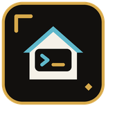

<p align="center">
  
</p>

<h1 align="center"><code>home</code></h1>

<p align="center"><strong>One CLI for the homelab.</strong></p>

<p align="center">
  Uniform access to homelab services for you and your local agents.<br>
  One binary, one config root, one agent-ready skill per module.
</p>

<p align="center">
  <a href="https://home.uptonm.dev">Website</a> ·
  <a href="https://home.uptonm.dev/docs">Documentation</a> ·
  <a href="./apps/home/README.md">CLI reference</a> ·
  <a href="./packages/brand/README.md">Brand kit</a>
</p>

## Install

```bash
curl -fsSL https://raw.githubusercontent.com/uptonm/home/main/scripts/install.sh | bash
```

Then initialize the shared config root and install the generated agent skills:

```bash
home init
home configure
home skill install
home status
```

## Workspace

This repository is a Bun monorepo:

| Workspace | Purpose |
| --- | --- |
| [`apps/home`](./apps/home) | The compiled TypeScript/Bun CLI, module adapters, tests, and release build |
| [`apps/site`](./apps/site) | Marketing and Fumadocs documentation site for [home.uptonm.dev](https://home.uptonm.dev) |
| [`packages/brand`](./packages/brand) | Reusable source mark, favicon/app-icon exports, social cards, and usage rules |

Common commands run from the repository root:

```bash
bun install
bun run home:dev -- status
bun run home:test
bun run site:dev
bun run site:build
bun run ci
```

See the [CLI reference](./apps/home/README.md) for modules, configuration,
commands, safety controls, and development details.
